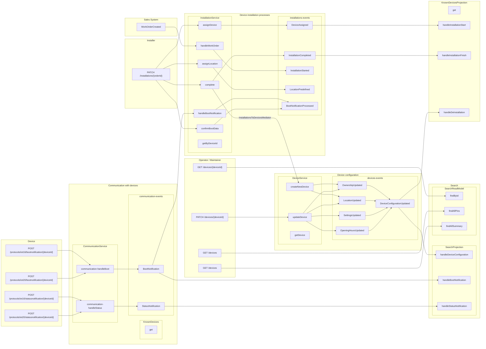

```mermaid
flowchart LR
    subgraph search[Search]
        direction TB
        subgraph SearchProjection
            search-handleDeviceConfiguration[handleDeviceConfiguration]
            search-handleBootNotification[handleBootNotification]
            search-handleStatusNotification[handleStatusNotification]
        end
        subgraph SearchReadModel
            search-findById[findById]
            search-findAllPins[findAllPins]
            search-findAllSummary[findAllSummary]
        end
    end
    DeviceConfigurationUpdated --> search-handleDeviceConfiguration
    BootNotification --> search-handleBootNotification
    StatusNotification --> search-handleStatusNotification
    BootNotification --> inst-handleBootNotification

    subgraph Device
        communication-iot16-bootNotificationRequest["POST /protocols/iot16/bootnotification/{deviceId}"]
        communication-iot16-statusNotificationRequest["POST /protocols/iot16/statusnotification/{deviceId}"]
        communication-iot20-bootNotificationRequest["POST /protocols/iot20/bootnotification/{deviceId}"]
        communication-iot20-statusNotificationRequest["POST /protocols/iot20/statusnotification/{deviceId}"]
    end
    communication-iot16-bootNotificationRequest --> communication-handleBoot
    communication-iot16-statusNotificationRequest --> communication-handleStatus
    communication-iot20-bootNotificationRequest --> communication-handleBoot
    communication-iot20-statusNotificationRequest --> communication-handleStatus

    subgraph communication[Communication with devices]
        direction TB
        subgraph CommunicationService
            communication-handleBoot
            communication-handleStatus
        end
        subgraph communication-decision[KnownDevices]
            communication-get[get]
        end
        subgraph communication-events
            BootNotification
            StatusNotification
        end
    end

    subgraph KnownDevicesProjection
        known-get[get]
        known-handleInstallationStart[handleInstallationStart]
        known-handleInstallationFinish[handleInstallationFinish]
        known-handleDeInstallation[handleDeInstallation]
    end
    
    communication-handleBoot --> BootNotification
    communication-handleStatus --> StatusNotification
    DeviceAssigned --> known-handleInstallationStart
    InstallationCompleted --> known-handleInstallationFinish
    DeviceConfigurationUpdated --> known-handleDeInstallation

    subgraph installations[Device installation processes]
        direction TB
        subgraph InstallationService
            inst-handleWorkOrder[handleWorkOrder]
            inst-assignDevice[assignDevice]
            inst-assignLocation[assignLocation]
            inst-handleBootNotification[handleBootNotification]
            inst-confirmBootData[confirmBootData]
            inst-complete[complete]
            inst-getByDeviceId[getByDeviceId]
        end
        subgraph installations-events
            InstallationStarted
            DeviceAssigned
            LocationPredefined
            BootNotificationProcessed
            InstallationCompleted
        end
    end
    inst-handleWorkOrder --> InstallationStarted
    inst-assignDevice --> DeviceAssigned
    inst-assignLocation --> LocationPredefined
    inst-handleBootNotification --> BootNotificationProcessed
    inst-confirmBootData --> BootNotificationProcessed
    inst-complete --> InstallationCompleted
    inst-complete -- InstallationsToDevicesMediator --> devices-createNewDevice

    subgraph Installer
        installer-patchInstallation["PATCH /installations/{orderId}"]
    end
    WorkOrderCreated --> inst-handleWorkOrder

    subgraph Sales System
        WorkOrderCreated
    end
    installer-patchInstallation --> inst-assignDevice
    installer-patchInstallation --> inst-assignLocation
    installer-patchInstallation --> inst-confirmBootData
    installer-patchInstallation --> inst-complete

    subgraph devices[Device configuration]
        subgraph DeviceService
            devices-createNewDevice[createNewDevice]
            devices-updateDevice[updateDevice]
            devices-getDevice[getDevice]
        end
        subgraph devices-events
            OwnershipUpdated
            LocationUpdated
            SettingsUpdated
            OpeningHoursUpdated
            DeviceConfigurationUpdated
        end
    end
    devices-createNewDevice --> OwnershipUpdated
    devices-createNewDevice --> LocationUpdated
    devices-updateDevice --> OwnershipUpdated
    devices-updateDevice --> LocationUpdated
    devices-updateDevice --> SettingsUpdated
    devices-updateDevice --> OpeningHoursUpdated
    OwnershipUpdated --> DeviceConfigurationUpdated
    LocationUpdated --> DeviceConfigurationUpdated
    SettingsUpdated --> DeviceConfigurationUpdated
    OpeningHoursUpdated --> DeviceConfigurationUpdated

    subgraph Operator / Maintainer
        operator-patchDevice["PATCH /devices/{deviceId}"]
        operator-getSummary["GET /devices"]
        operator-getPins["GET /devices"]
        operator-getDetails["GET /devices/{deviceId}"]
    end
    operator-patchDevice --> devices-updateDevice
    operator-getSummary --> search-findAllSummary
    operator-getPins --> search-findAllPins
    operator-getDetails --> search-findById
```
